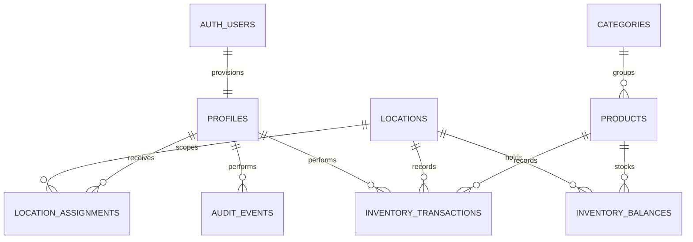

# V1 architecture

## Implemented boundary

The current milestone is the inventory vertical slice. It includes staff authentication structure, profile activation, permissions, assignments, translated UI, location/catalog reads, stock additions/removals, immutable history, low-stock indicators and PWA metadata.

The application uses the user's Supabase session for every query. Server Components read data; Server Actions authenticate again and validate mutation inputs with Zod. RLS limits reads and PostgreSQL functions authorize every write. There is no service-role client, demo login, fake-data mode or direct balance update from JavaScript.

## Authorization

| Role                  | Inventory reads     | Add/general removal | Tour consumption   | Catalog configuration |
| --------------------- | ------------------- | ------------------- | ------------------ | --------------------- |
| OWNER                 | All locations       | Yes                 | Yes                | Yes                   |
| MANAGER / Encargado   | All locations       | Yes                 | Yes                | No                    |
| CAPTAIN / Capitán     | Assigned locations  | No                  | Assigned locations | No                    |
| CREW / Tripulación    | Assigned locations  | No                  | Assigned locations | No                    |
| Inactive or anonymous | No operational data | No                  | No                 | No                    |

New profiles are always inactive CREW, regardless of user-supplied metadata. Account creation and activation are currently administrator operations in Supabase. Role-management UI and its owner-only RPC are deliberately deferred. Catalog DML is owner-only; balance thresholds go through `configure_inventory`. There are no authenticated grants for history deletion, direct balance writes, or profile role changes.

This is a single-company deployment. Supporting multiple companies requires company foreign keys and a full RLS review; adding a company dropdown would not be sufficient.

## Inventory integrity

`change_stock` validates allowed type/reason pairs, role, location scope, positive finite quantities and three-decimal precision. It serializes request IDs with an advisory transaction lock, then locks the balance row. It updates that row, inserts the movement and inserts an audit event in a single PostgreSQL transaction. Any exception rolls the entire operation back.

Quantities in movements are signed deltas. Each row constrains `resulting_quantity = previous_quantity + quantity`. Both history tables reject update/delete operations with triggers, in addition to restrictive grants. Products/locations are archived using `active`, not deleted.

Negative stock is prohibited, including for owners. An eventual negative-stock override must be a separate permissioned workflow with a required reason. Stock quantities use `numeric(14,3)`. Financial fields use `numeric(14,2)`; the minor-unit helper uses BigInt, never float addition.

A UUID identifies each form attempt and persists across validation/network retries. An identical retry returns the existing transaction. Reusing the ID with a different payload or actor is rejected. Controlled form fields preserve the user's entry on errors. A fresh action page creates a new attempt ID.

## Data and UI conventions

- Profile language is persisted in PostgreSQL; sign-in synchronizes the rendering cookie. Language changes update both. Cookie preferences allow the login/setup screens to work before authentication.
- Translation dictionaries have compile-time key parity. All inventory labels, errors, units and movement reasons are translated. Product names and bilingual category names are database content.
- Server reads are scoped by RLS and not publicly cached. Catalog reads are deduplicated within a request. PostgREST result pages are collected explicitly rather than silently stopping at the default limit. Movement history is paginated in groups of 20.
- Current catalog size is expected to be small. Introduce server-side search/pagination before expanding to thousands of products per location.
- Mobile cards and a fixed bottom navigation are the primary layout. At desktop widths a sidebar replaces the bottom bar. Controls are at least 44px tall; inputs use 16px text to avoid phone zoom.
- Native select controls retain mobile operating-system selection behavior. shadcn/ui supplies the shared buttons, cards, inputs and labels. Card contents own their padding.
- No offline writes or private-data service-worker cache. PWA assets prepare installation; reliable offline synchronization is a later design task.

## Next module migrations (not implemented)

| Module         | Planned normalized entities and integrity rules                                                                                                                                                                                                            |
| -------------- | ---------------------------------------------------------------------------------------------------------------------------------------------------------------------------------------------------------------------------------------------------------- |
| Transfers      | A transfer header linking two immutable movements; lock both balances in deterministic location order and commit both sides atomically.                                                                                                                    |
| Stock counts   | `stock_counts` and `stock_count_items` with expected, actual and variance; detect concurrent movements before applying adjustments. Link adjustment movements to the session.                                                                              |
| Purchases      | `purchases` and `purchase_items`, explicit draft/finalized states, per-line locations, supplier/payment/currency metadata. Finalization and ledger writes in one idempotent RPC.                                                                           |
| Expenses       | `expenses` and configurable `expense_categories`; separate noninventory spending from purchases. Reports must avoid counting a purchase and its payment twice.                                                                                             |
| Receipts       | `receipts` metadata pointing to private Supabase Storage objects and exactly one expense or purchase. Signed URLs, file-size/MIME limits and scoped Storage policies. Product photos can use a separate bucket. No storage bucket or upload UI exists yet. |
| Reimbursements | One reimbursement per personally funded expense/purchase; pending/reimbursed status, payer, amount, currency and owner-confirmed settlement actor/time.                                                                                                    |
| Shopping lists | Derived shortfalls from target minus balance, plus separate manually entered list items. Derived shortfalls disappear when replenished.                                                                                                                    |

Do not enable purchase/transfer/count transaction types via the general stock RPC. Each needs its own transactional validation and tests. These enum values reserve the model vocabulary but are intentionally rejected by the current mutation function.

## Verification boundary

PGlite tests execute the actual migration, constraints, role grants and RLS against PostgreSQL. The test Auth schema substitutes only the Supabase user table and `auth.uid()` environment. PGlite queues statements, so competing-removal tests establish the no-overselling invariant but do not simulate independent database connections contending for locks.

Playwright tests run the real unconfigured Next.js application plus a separate test-only component harness. The harness uses explicit fixtures and adapters for Next.js navigation/server actions. It is not routed, imported or served by the application. It verifies rendering and interactions, not authentication or persistence.

Before operational rollout, apply migrations to a real Supabase project and verify password login, cookie refresh, PostgREST results, stock mutations, retries and simultaneous removals with multiple sessions. Confirm real device/browser behavior and deployment configuration. The current milestone is not a claim of production readiness without those checks.
